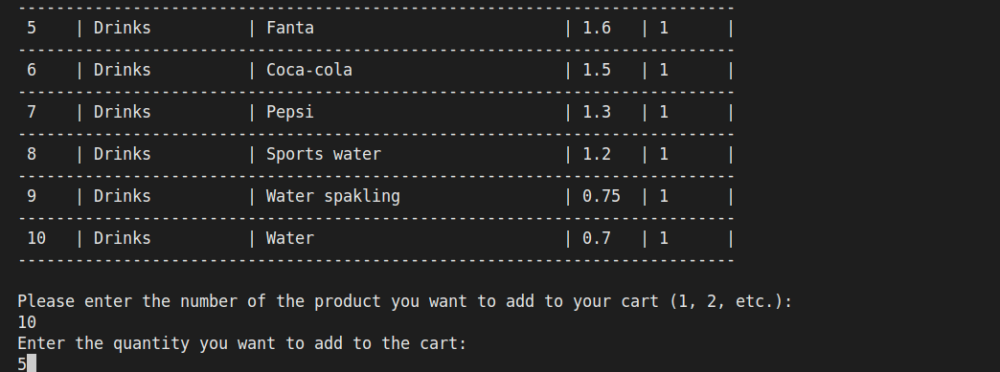
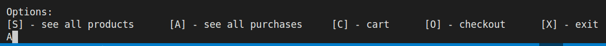

# Freshly
## Ievads
"Freshly" ir sistēma caur kuru var iegadāties dažāda veida produktus, kā piem. dzērienus, auguļus, dārzeņus un gaļu. Sistēmas mērķis ir dot iespēju klientiem iegādāties kvalitātīvus un sertificētus produktus, kurus ir iespējams filtrēt klienta vajadzībām, kā arī ērti un droši veikt produktu pasūtīšanu.

## Lietotāja interfeisa pārskats
### Galvenā izvelne

Šajā skatā mūs sveic sistēmas logo, kā arī iespējas pieslēgties un reģistrēties, kā arī iziet no sistēmas.

### Lietotāja galvenā izvelne

Šis skats ir pieejams lietotājam, kas ir pieslēdzies. Piedāvātās opcijas - apskatīt visu produktu asortimentu, apskatīt pirkumu vēsturi, grozs, noformēt pasūtījumu un iziet no sistēmas.

### Produktu asortiments

Šajā skatā tabulas formātā tiek izvadīts viss produktu asortiments. Papildus lietotājam ir iespēja filtrēt produktus pēc kategorijas, meklēt pēc nosaukuma, pievienot produktu grozam, kā arī atgriezties atpakaļ uz galveno izvēlni.

### Pirkumu vēsture

Šajā skatā tiek izvadīti visi iepriekš veiktie pirkumi, kas ir iedalīti pa sesijām, redzot produkta nosaukumu, cenu, svaru un kvantitāti.

### Grozs

Šajā skatā var apskatīt visus grozā pievienotos produktus. Tiek izvadīts produkta - nosaukums, kategorija, cena, svars un kvantitāte. Kā arī lietotājam ir iespēja noņemt pievienoto produktu, veikt pirkumu un ievadīt promokodu.

## Funkciju apraksti
### Lietotāja reģistrācija

Izvēloties reģistrācijas opciju, lietotājam ir nepieciešams ievadīt:
- vārdu,
- uzvārdu,
- lietotājvārdu,
- e-pastu;

Pēc kā nospiežot taustiņu ENTER tiks veikta datu validācija, pēc kuras lietotājs tiks reģistrēts.

### Lietotāja pieslēgšanās

Pēc tā kad lietotājs izvēlas pieslēgšanās opciju, būs nepieciešams ievadīt pieslēgšanās datus, tas ir:
- lietotājvārds,
- e-pasts;

Pēc kā tiks veikta datu validācija un lietotāja pieslēgšanas process tiks uzsākts. Ja lietotājs eksistēs, tad tas tiks pieslēgts sistēmai.

### Produktu filtrēšana
1. Izvēlamies opciju apskatīt visus produktus, nospiežot taustiņu "S" un pēc tam ENTER taustiņu.

2. Tika izvadīts visu produktu saraksts, pēc kā nospiežam taustiņu "C", lai veiktu filtrāciju pēc kategorijas.

3. Tagad tiek izvadītas visas iespējamās kategorijas. Veiksim filtrāciju pēc dzērienu kategorijas, lai to izdarītu ievadam kategorijas nosaukumu. Pēc kā nospiežam taustiņu ENTER.

4. Pēc tā kad tika nofiltrēts pēc kategorijas, tiek piedāvātas opcijas sakārtot produktus - pēc cenas un alfabēta. Izvēlēsimies kārtot pēc cenas dilstoša secībā, nospiežot taustiņu "U" un ENTER.

5. Rezultātā mums izvada nofiltrētus un sakārtotus produktus. Nākamais solis jau būtu pievienot izvēlēto produktu grozam. 

### Produkta pievienošana grozam
1. Balstoties uz iepriekš nofiltrētajiem datiem, mēs varam pievienot produktu grozam. Izvadītajā tabulā ir kolonna No., kas nozīmē produkta nr. Izvēlamies produktu, ko pievienot grozā ierakstot produkta nr. un nospiežot taustiņu ENTER,

2. Pēc tā kad tika izvēlēts produkts, ir nepiciešams ievadīt nepieciešamo produkta kvantitāti un nospiest taustiņu ENTER, lai apstiprinātu.

3. Produkts tika veiksmīgi pievienots grozam. Tagad lai apskatītu grozu ir nepieciešams atgriezties uz galveno ekrānu nospiežot taustiņu X un ENTER.
4. Lai apskatītu grozu, nepieciešam nospiest taustiņu C un ENTER.

5. Rezultātā mums izvada grozu ar mums jau pievienoto produktu. Papildus ir opcijas - noņemt produktu, veikt pasūtījumu un ievadīt promokodu.

### Promokoda ievadīšana
1. Groza skatā nospiežam taustiņu P un ENTER.

2. Pēc kā ir dota iespēja ievadīt promokodu. Ierakstot frāzi "PROMO" un nospiežot taustiņu ENTER tiks piešķirta 15% atlaide uz pasūtījumu.

3. Rezultātā mēs redzam, ka gala summa ir samazinājusies par 15%.

### Pasūtījuma noformēšana
1. Lai noformētu pasūtījumu ir nepieciešams atvērt grozu. Pēc kā nospiest taustiņu "C" un ENTER lai noformētu pasūtījumu.

2. Pēc kā tiks izvadīts paziņojums par to, ka pasūtījums tika veiksmīgi noformēts.

### Pirkumu vēstures apskatīšana
1. Nepieciešams atgriezties uz galveno izvelni. Pēc kā nospiest taustiņu "A" un ENTER.

2. Rezultātā izvadīs tabulu ar veiktajiem pasūtījumiem.
